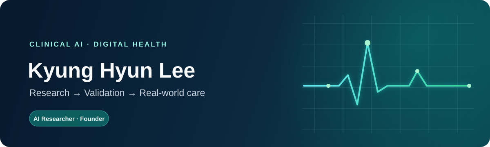

  

  
  
  
  

  <a href="#research-areas">Research Areas</a> ·
  <a href="#current-research">Current Research</a> ·
  <a href="#selected-first-author-publications">Publications</a> ·
  <a href="https://jovinus.github.io/publications/">All publications</a>

## Academic profile

I am a clinical AI researcher working at the intersection of **machine learning, longitudinal health data, and clinical translation**. My research focuses on developing and validating models that can support real-world decision-making, with particular interests in early-warning systems, respiratory digital health, and software as a medical device (SaMD).

I am an **AI Researcher at [AITRICS](https://www.aitrics.com)** and a **PhD student in Digital Health at [SAIHST, Sungkyunkwan University](https://www.saihst.kr/)**, advised by **Prof. Byung-Jae Lee**. I also co-founded [BreathYou](https://breathyou.care), where we translate respiratory AI research into clinician-facing tools.

<table>
  <tr>
    <td align="center" width="25%"><strong>25+</strong> peer-reviewed publications</td>
    <td align="center" width="25%"><strong>Clinical AI</strong> early-warning systems</td>
    <td align="center" width="25%"><strong>Multicenter</strong> external validation</td>
    <td align="center" width="25%"><strong>SaMD</strong> regulatory translation</td>
  </tr>
</table>

## Research areas

| | Focus | What I work on |
|:--:|---|---|
| 🫁 | **Respiratory digital health** | Pulmonary-function trajectories, Korean reference equations, and clinical decision support |
| ⏱️ | **Clinical time series** | Transformers for AKI, sepsis, and cardiac-arrest early warning |
| 🛡️ | **Trustworthy medical AI** | External validation, real-world monitoring, and SaMD regulatory pathways |
| 🫀 | **Physiological signals** | HRV, ECG, EMG, and multimodal affective computing |

## Current research

<table>
  <tr>
    <td width="33%" valign="top">
      <h3>🫁 Pulmonary trajectories</h3>
      
Longitudinal modeling of pulmonary-function decline and incident airflow obstruction.

      <strong>Doctoral research · SAIHST</strong>
    </td>
    <td width="33%" valign="top">
      <h3>🩺 AKI early warning</h3>
      
Multicenter validation, continuous-monitoring simulation, and clinical deployment.

      <strong>Clinical translation · AITRICS</strong>
    </td>
    <td width="33%" valign="top">
      <h3>📝 Clinical data pipelines</h3>
      
OCR and NLP methods for structuring longitudinal information from medical records.

      <strong>Applied research · BreathYou</strong>
    </td>
  </tr>
</table>

## Selected first-author publications

All publications shown below are first- or co-first-authored. Complete list on my <a href="https://jovinus.github.io/publications/">publication page</a> and <a href="https://scholar.google.com/citations?user=T0DHr9QAAAAJ">Google Scholar</a>.

> **Featured · npj Digital Medicine (2026)** 
> **Deep learning models for acute kidney injury prediction** — multicenter external validation under simulated continuous monitoring. 
> [Read the paper](https://doi.org/10.1038/s41746-026-02722-2) · Co-first author

| Year | Work | Venue | Links |
|:--:|---|---|:--:|
| 2025 | Validation of an AI-based algorithm for sepsis prediction and risk stratification using real-world data | *BMJ Health & Care Informatics* | [Paper](https://doi.org/10.1136/bmjhci-2024-101353) |
| 2025 | Deep learning-based stress detection from RR intervals in psychiatric disorders and healthy individuals | *Frontiers in Psychiatry* | [Paper](https://doi.org/10.3389/fpsyt.2025.1672260) · [Code](https://github.com/Jovinus/HRV) |
| 2024 | Novel AI-based technology to diagnose asthma using methacholine challenge tests | *Allergy, Asthma & Immunology Research* | [Paper](https://doi.org/10.4168/aair.2024.16.1.42) · [Code](https://github.com/Jovinus/Asthma_study) |
| 2022 | Cardiorespiratory fitness, healthy vascular aging, and subclinical atherosclerosis | *Hypertension* | [Paper](https://doi.org/10.1161/HYPERTENSIONAHA.122.19016) |
| 2021 | Electromyogram-based classification of hand and finger gestures using artificial neural networks | *Sensors* | [Paper](https://doi.org/10.3390/s22010225) · [Code](https://github.com/Bioelectronics-Laboratory/EMG_hand_finger_gestures_classification) |

<strong>More publications and recognition</strong>

 

**Additional first / co-first author publications**

- *Development of a Transformer-Based Cardiac Arrest Prediction Model for General Ward Patients.* medRxiv, 2026. [Paper](https://doi.org/10.64898/2026.01.12.26343973)
- *Development of a Labeling Algorithm for Early Prediction of Acute Kidney Injury.* MIE 2025. [Paper](https://doi.org/10.3233/SHTI250415)
- *Association between cardiorespiratory fitness and the trend of age-related rise in arterial stiffness.* American Journal of Hypertension, 2025. [Paper](https://doi.org/10.1093/ajh/hpae124)
- *Age prediction in healthy subjects using RR intervals and heart rate variability.* Applied Sciences, 2023. [Paper](https://doi.org/10.3390/app13052932) · [Code](https://github.com/Jovinus/Autonomic_Aging)

**Recognition**

- ETRI Director's Award (Top 7), Human Understanding AI Paper Competition — 2022
- Excellence Award, NIA OCR AI Training Data Hackathon — 2021
- Grand Prize, Asan Medical Center Medical Information Analysis course — 2021

See the complete, maintained list on my [publication page](https://jovinus.github.io/publications/) or [Google Scholar](https://scholar.google.com/citations?user=T0DHr9QAAAAJ).

## Methods & tools

  
  
  
  
  
  
  
  
  

---

  <strong>Open to research collaborations in clinical AI and digital health.</strong> 
  Clinical time series · Respiratory health · External validation · SaMD  
  <a href="mailto:lkh256@g.skku.edu">Email</a> ·
  <a href="https://www.linkedin.com/in/kyunghyun-lee-7963a3184">LinkedIn</a> ·
  <a href="https://jovinus.github.io">jovinus.github.io</a>

